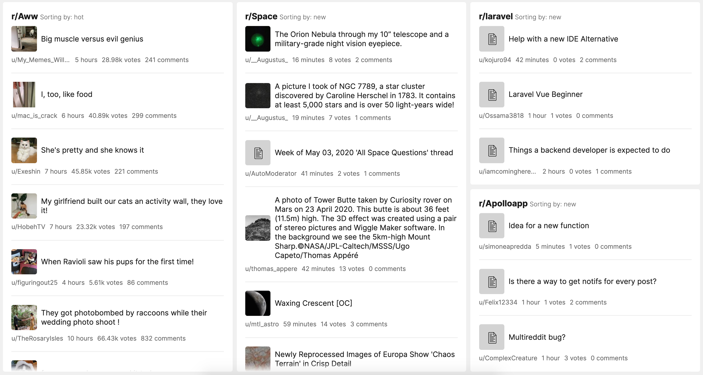

# Reddit tile for [Laravel Dashboard](https://docs.spatie.be/laravel-dashboard).

[](https://packagist.org/packages/jeop10/laravel-dashboard-reddit-tile)
[](https://github.com/jeop10/laravel-dashboard-reddit-tile/actions?query=workflow%3Arun-tests+branch%3Amaster)
[](https://packagist.org/packages/jeop10/laravel-dashboard-reddit-tile)

This tile can display a list of the post to your favorite subreddit. 



This tile can be used on [the Laravel Dashboard](https://docs.spatie.be/laravel-dashboard).

## Installation

You can install the package via composer:

```bash
composer require jeop10/laravel-dashboard-reddit-tile
```

## Usage

In the `dashboard` config file, you must add this configuration in the `tiles` key.
`````php
// in config/dashboard.php

return [
    // ...
    'tiles' => [
        'reddit' => [
            'general' => [
                'timezone' => 'Your desired timezone', //Important to get the posted at
            ],
            'configurations' => [
                'default' => [
                    'subreddit' => 'aww',
                    'sort_by' => 'hot', // valid values are hot, new, rising, controversial, top
                    'refresh_interval_in_seconds' => 120,
                ],
                'covid' => [
                    'subreddit' => 'coronavirus',
                    'sort_by' => 'new',
                    'refresh_interval_in_seconds' => 60,
                ],
                //...
            ]
        ]   
    ]   
];
`````

In your dashboard view you use the `livewire:reddit-tile` component.

```html
<x-dashboard>
    <livewire:reddit-tile position="a1:a4" configuration-name="default" title="r/Aww"/>
</x-dashboard>
```

The title attribute is optional


## Testing

``` bash
composer test
```

## Changelog

Please see [CHANGELOG](CHANGELOG.md) for more information on what has changed recently.

## Contributing

Please see [CONTRIBUTING](CONTRIBUTING.md) for details.

## Security

If you discover any security related issues, please email :author_email instead of using the issue tracker.

## Credits

- [All Contributors](../../contributors)
- File Icon by [Raj Dev](https://freeicons.io/profile/714) URL: [Link](https://freeicons.io/documents-icons-2/icon-document-text-icon-7477)
- Web Icon by [Raj Dev](https://freeicons.io/profile/714) URL: [Link](https://freeicons.io/documents-icons-2/icon-note-icon-7462#)

## License

The MIT License (MIT). Please see [License File](LICENSE.md) for more information.
